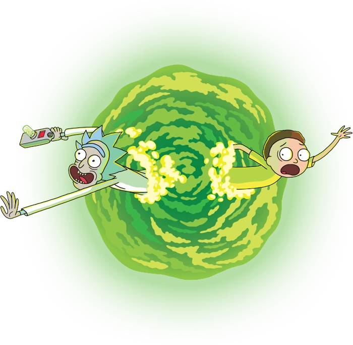

<!-- PROJECT LOGO -->
 

  

  <h3 align="center">RickAndMortyApp</h3>

  

    An app that show the characters list of the TV Animated Series Rick & Morty
     
    This app provides a filter for search any character by name, status(Alive, Dead, Unknown), gender and specie
  

<!-- TABLE OF CONTENTS -->

  
Table of Contents

    <ul>
        <li><a href="#built-with">Built With</a></li>
    </ul>

[![Main Screen][product-screenshot]](https://rickandmortyapi.com)

### Built With
* ![Android][Android]
* 
* ![Kotlin][Kotlin]
* ![Gradle][Gradle]
  

<a href="#readme-top">back to top</a>

<!-- MARKDOWN LINKS & IMAGES -->
<!-- https://www.markdownguide.org/basic-syntax/#reference-style-links -->
[linkedin-url]: https://linkedin.com/in/linkedin_username
[product-screenshot]: product_screenshot.png
[Android]: https://img.shields.io/badge/Android-0769AD?style=for-the-badge&logo=android&logoColor=white
[Kotlin]: https://img.shields.io/badge/kotlin-%237F52FF.svg?style=for-the-badge&logo=kotlin&logoColor=white
[Gradle]: https://img.shields.io/badge/Gradle-02303A.svg?style=for-the-badge&logo=Gradle&logoColor=white
